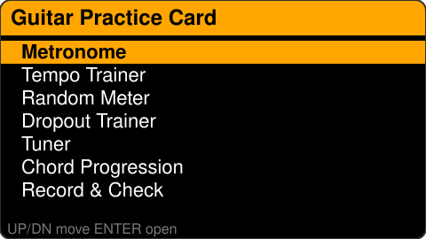
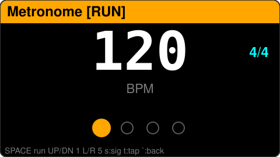
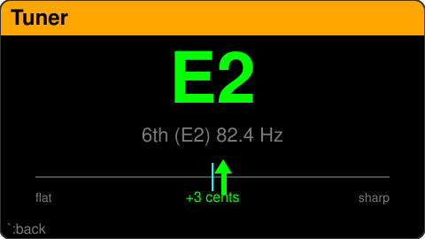
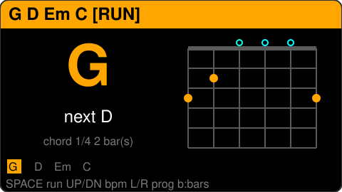
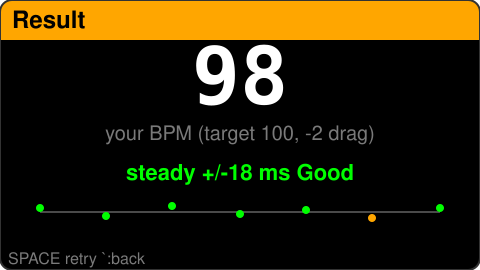

# Guitar Practice Card

A pocket **guitar practice tool for the [M5Stack Cardputer](https://docs.m5stack.com/en/core/Cardputer)** —
metronome, tempo trainers, a microphone tuner, chord charts, and a rhythm‑steadiness
grader, all in one keyboard‑driven app.

It is a standalone ESP32‑S3 firmware. You can flash it directly over USB, or install and
boot it from [bmorcelli/Launcher](https://github.com/bmorcelli/Launcher) alongside other apps.

> Status: **all 7 features working.** Flash usage ~15%, RAM ~12% — lots of room to grow.

---

## Table of contents

- [Features](#features)
- [Screenshots](#screenshots)
- [Controls](#controls)
- [Hardware](#hardware)
- [Build & flash](#build--flash)
- [Running from Launcher (no USB)](#running-from-launcher-no-usb)
- [Project structure](#project-structure)
- [Adding your own feature](#adding-your-own-feature)
- [How it works (technical notes)](#how-it-works-technical-notes)
- [Troubleshooting](#troubleshooting)
- [Roadmap](#roadmap)
- [Credits & license](#credits--license)

---

## Features

All features share one tempo/time‑signature setting, so a BPM you set in one place carries
over to the others.

| Feature | What it does |
|--------|--------------|
| **Metronome** | Adjustable BPM (30–300), time signatures **4/4, 3/4, 2/4, 6/8** or any **1–12 beats per bar** (carried over to the trainers), accented downbeat (higher click on beat 1), visual beat dots, audible click through the 1 W speaker. Built‑in **tap tempo**. |
| **Tempo Trainer** | Starts at a *Start* BPM and automatically increases by *Step* BPM every *Every* bars until it reaches *Target*. For practicing a lick clean, then gradually faster. |
| **Random Meter** | Randomly switches time signature every phrase (you choose the phrase length in bars) to train your feel for changing meters. |
| **Dropout Trainer** | The click plays for *Play* bars then goes **silent** for *Mute* bars. Keep the tempo on your own; you'll hear whether you drifted when it comes back. |
| **Tuner** | Detects the pitch you play on the built‑in mic and shows the nearest note, cents sharp/flat, the frequency, and which guitar string it is. Turns **green** when you're within ±5 cents. Holds the last note on screen ~2 s after you stop. |
| **Chord Progression** | Shows a looping chord chart that advances with the beat, with an **open‑chord fingering diagram** for each chord. Five built‑in progressions including a 12‑bar blues. |
| **Record & Check** | Counts you in for 4 beats, then records you playing steady quarter notes and grades your **tempo steadiness** (jitter in ms) and **drift** (rushing/dragging) versus the target. |

---

## Screenshots

> UI mockups rendered from the actual on‑device layout and colours (240 × 135). Swap in
> real device photos anytime by replacing the files in [`docs/`](docs/).

| Menu | Metronome | Tuner |
|:----:|:---------:|:-----:|
|  |  |  |

| Chord Progression | Record & Check |
|:-----------------:|:--------------:|
|  |  |

---

## Controls

The Cardputer's arrow legends are printed on the `;` `.` `,` `/` keys, and `Esc` is the
backtick (`` ` ``) key. Those are used everywhere:

| Key | Action |
|-----|--------|
| `;` / `.` | Up / Down |
| `,` / `/` | Left / Right |
| `Enter` | Select / confirm |
| `Space` | Start / stop |
| `` ` `` (Esc) | Back to menu |

Per‑feature keys (shown in each screen's footer):

- **Metronome** — `Space` run · `;`/`.` BPM ±1 · `,`/`/` BPM ±5 · `1`–`9` beats per bar · `-`/`=` beats ±1 (up to 12) · `s` preset time signature · `t` tap tempo
- **Tempo Trainer** — `,`/`/` pick field (Start / Target / Step / Every) · `;`/`.` change · `Space` run
- **Random Meter** — `Space` run · `;`/`.` BPM · `,`/`/` phrase length
- **Dropout Trainer** — `,`/`/` pick field (BPM / Play / Mute) · `;`/`.` change · `Space` run
- **Tuner** — just play a single string; `` ` `` to go back
- **Chord Progression** — `Space` run · `;`/`.` BPM · `,`/`/` progression · `b` bars per chord
- **Record & Check** — `,`/`/` pick field (BPM / Beats) · `;`/`.` change · `Space` start · then follow the count‑in

---

## Hardware

- **M5Stack Cardputer** (ESP32‑S3 "StampS3" module, 8 MB flash, **no PSRAM**)
- 240 × 135 ST7789 display
- Full QWERTY matrix keyboard
- SPM1423 **PDM microphone** (used by the Tuner and Record & Check)
- NS4168 **1 W I2S speaker** (metronome click)

> The mic and speaker share the I2S bus and **cannot run at the same time**. The mic
> features stop the speaker while listening and restore it on exit — see the technical
> notes below.

---

## Build & flash

The project uses **[PlatformIO](https://platformio.org/)**. You can use the VS Code
PlatformIO extension, or PlatformIO Core (`pio`) from the command line.

```bash
# compile  ->  .pio/build/cardputer/firmware.bin
pio run

# flash over USB-C
pio run -t upload

# serial monitor (115200)
pio device monitor
```

Key settings ([platformio.ini](platformio.ini)):

```ini
[env:cardputer]
platform  = espressif32
board     = m5stack-stamps3     ; the Cardputer's module
framework = arduino
lib_deps  = m5stack/M5Cardputer ; pulls in M5Unified + M5GFX
```

The compiled `firmware.bin` is a normal ESP32‑S3 **application image** (starts with the
`0xE9` magic byte). That's the file you hand to Launcher.

---

## Running from Launcher (no USB)

You do **not** need to modify Launcher. Install Launcher once, then load this app into it.

### 1. Flash Launcher (one‑time, over USB)

Download the Cardputer build from the
[Launcher releases](https://github.com/bmorcelli/Launcher/releases) —
`Launcher-m5stack-cardputer.bin` — and flash it at offset `0x0` (it is a full merged image
with bootloader + partition table + app):

```bash
esptool.py --chip esp32s3 --port <PORT> --baud 921600 erase_flash
esptool.py --chip esp32s3 --port <PORT> --baud 921600 write_flash 0x0 Launcher-m5stack-cardputer.bin
```

### 2. Install this app into Launcher

**With an SD card (recommended, most reliable):**
1. Format a small microSD card (**≤ 32 GB, FAT32**).
2. Copy `firmware.bin` (rename it e.g. `GuitarPractice.bin`) to the card.
3. Insert the card, open Launcher, browse to the file, and install/boot it.

**Over Wi‑Fi (WebUI, no SD card):**
1. On the device open **`WUI`** and note the address it shows. Log in with the default
   credentials `admin` / `launcher`.
2. Use the **`↑ OTA`** button (not "Files" — that path needs an SD card), select
   `firmware.bin`, and start the update. Launcher creates a new app partition
   automatically.

> Tip: Wi‑Fi uploads are much more reliable when the device is joined to your **home
> network** (the `WiFi` button) than when using the device's own hotspot. See
> [Troubleshooting](#troubleshooting).

You can always return to a plain single‑app device by re‑flashing over USB with
`pio run -t upload`.

---

## Project structure

Every screen is an **`App`**. The menu is an App, the metronome is an App, each feature is
an App. This mirrors how Launcher itself thinks about apps, and makes the codebase easy to
extend.

```
GuitarPractice/
├── platformio.ini
├── include/
│   └── App.h                  # App base class, input events, shared settings, UI helpers
├── src/
│   ├── main.cpp               # setup/loop, input decode, UI helper impls, app registry
│   ├── MenuApp.h              # scrollable home menu
│   ├── MetronomeEngine.h      # reusable beat scheduler + click + shared "face" drawing
│   ├── MetronomeApp.h         # Metronome (+ tap tempo)
│   ├── TempoTrainerApp.h      # auto tempo ramp
│   ├── RandomMeterApp.h       # random time signatures
│   ├── DropoutTrainerApp.h    # muted-bar trainer
│   ├── TunerApp.h             # YIN pitch detection
│   ├── ChordProgressionApp.h  # chord charts + fingering diagrams
│   └── RecordCheckApp.h       # count-in, record, grade steadiness
└── README.md
```

`MetronomeEngine` is the shared heart: the Metronome, all three trainers, and the chord
app drive one of these for beat timing and the click sound.

---

## Adding your own feature

1. Create `src/MyApp.h`:

   ```cpp
   #pragma once
   #include "App.h"

   class MyApp : public App {
   public:
     const char* title() const override { return "My Feature"; }
     void handle(const KeyEvent& k) override { /* react to keys */ dirty = true; }
     void tick() override { /* timing / audio each loop */ }
     void draw() override {
       ui::clear();
       ui::header("My Feature");
       // draw into ui::canvas ...
       ui::footer("`:back");
     }
   };
   ```

2. In [src/main.cpp](src/main.cpp): `#include "MyApp.h"`, create an instance, and add it to
   the `APPS = { ... }` list in `buildApps()`.

It appears in the menu automatically. All drawing goes through the shared, flicker‑free
back buffer `ui::canvas` and helpers (`ui::header`, `ui::footer`, `ui::field`,
`ui::paragraph`).

---

## How it works (technical notes)

**Flicker‑free rendering.** Everything draws into a full‑screen off‑screen canvas
(`M5Canvas`, ~63 KB) which is pushed to the display in a single blit each frame. Apps set
a `dirty` flag to request a redraw, so the screen only repaints when something changes.

**Mic / speaker I2S hand‑off.** Because the internal mic and speaker share I2S, the
mic features call `Speaker.end()` / `Mic.begin()` on entry and reverse it on exit. This is
why **Record & Check** clicks the count‑in *first* (speaker), then goes silent to record
(mic) — the two never run together.

**Tuner — pitch detection.** Uses the **YIN algorithm** (cumulative mean normalized
difference function), which is accurate and robust down to a low E (~82 Hz). It analyses
2048 samples at 16 kHz per frame, does parabolic interpolation for sub‑sample precision,
converts frequency to the nearest MIDI note and cents, and maps to the closest guitar
string.

**Record & Check — rhythm grading.** Detects note **onsets** from the recorded audio's
short‑time energy envelope (a sharp energy rise past an adaptive gate, with a refractory
period). It then measures the **intervals between onsets**, so the score depends only on
your *spacing*, not on absolute alignment — this makes it immune to microphone start‑up
latency. It reports your effective BPM, drift vs. the target, and the standard deviation of
your intervals as a "steadiness" figure. Audio is streamed into a heap buffer of up to
40 000 samples (5 s @ 8 kHz, ~80 KB) that is freed when you leave the screen.

---

## Troubleshooting

**WebUI upload fails / "Upload Failed".** This is almost always the Wi‑Fi transfer
dropping, not a space problem (the Launcher partition table leaves several MB of free
flash for a new app partition). Try, in order:
1. Reload the WebUI page, log in again, then use **`↑ OTA`** (not "Files").
2. Join the device to your **home Wi‑Fi** (the `WiFi` button) and upload over the LAN —
   far more stable than the device's own hotspot.
3. Use an **SD card** instead — the most reliable path.

**"Files" upload shows 0 B / doesn't stick.** The Files browser stores to the SD card;
with no card the totals read `0 B`. Use `↑ OTA` for SD‑free installs, or add a card.

**Bricked?** You can't permanently brick an ESP32‑S3 — put it in download mode if needed
and re‑flash over USB with `pio run -t upload` (this app) or esptool (Launcher).

**Tuner shows `--` or jumps octaves.** Play a single string clearly and let it ring; very
quiet or very noisy input is rejected on purpose.

**Record & Check says "play clearer plucks".** It needs clear note attacks to find onsets.
Pluck/strum distinctly rather than playing legato.

---

## Roadmap

Ideas, not promises:

- [ ] Editable / user‑defined chord progressions
- [ ] Save favourite tempos and settings to NVS
- [ ] Waveform / spectrum view in the tuner
- [ ] Playback of the recorded take in Record & Check
- [ ] More chord voicings and barre shapes

Contributions and suggestions welcome.

---

## Credits & license

- Built for the **M5Stack Cardputer** using **[M5Cardputer / M5Unified / M5GFX](https://github.com/m5stack/M5Cardputer)**.
- Designed to run under **[bmorcelli/Launcher](https://github.com/bmorcelli/Launcher)**.
- Pitch detection based on the **YIN** method — de Cheveigné & Kawahara, *"YIN, a
  fundamental frequency estimator for speech and music"* (2002).

Licensed under the **MIT License** — add a `LICENSE` file before publishing if you want it
to be explicit. You're free to use, modify, and share.
